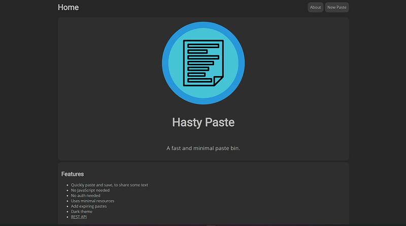
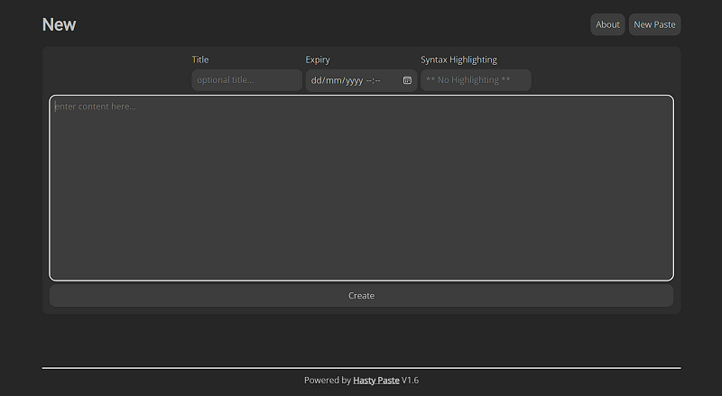
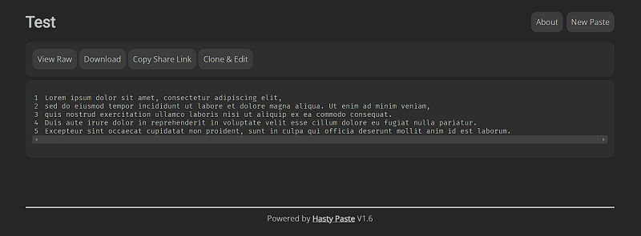

# Komdatcoba
Repository tugas UTS komdat 2022

<p style="font-size:20px"><b>Hasty Paste"</b></p>

<p style="font-size:14px">Sekilas Tentang "Hasty Paste"</p>
<p>Deskripsi Judul. [Isi disini]</p>

<p style="font-size:20px"><b>Instalasi</b></p>
<p style="font-size:14px"><b>Prasyarat Sebelum instalasi</b></p>
<ol>
<li>Docker</li>
<li>Docker</li>
</ol>
<b>Langkah instalasi dalam CLI dengan docker</b>
<ol>
<li>

Langkah-langkah yang diperlukan adalah sebagai berikut : 

<b>Docker</b>

Update APT
  ```
  sudo apt update
  sudo apt install -y docker.io
  ```
Buka file policy-rc.d
  ```
  nano /usr/sbin/policy-rc.d
  ```
Lalu ubah 101 menjadi 0

Kemudian install requirements lainnya
  ```
  sudo apt-get install ca-certificates curl gnupg lsb-release
  ```
Keyrings
  ```
  sudo mkdir -p etc/apt/keyrings
  
  curl -fsSL https://download.docker.com/linux/ubuntu/gpg | sudo gpg --dearmor -o /etc/apt/keyrings/docker.gpg
  
  echo "deb [arch=$(dpkg --print-architecture) signed-by=/etc/apt/keyrings/docker.gpg] https://download.docker.com/linux/ubuntu \
$(lsb_release -cs) stable" | sudo tee /etc/apt/sources.list.d/docker.list > /dev/null
  ```
Plugins
  ```
  sudo apt-get update
  sudo apt-get install docker-ce docker-ce-cli containerd.io docker-compose-plugin
  ```
Cek Status docker
  ```
  service docker status
  ```
<b>Pemasangan Hasty Paste dengan docker</b>
  ```
  sudo apt install git
  ```
Buat file baru di folder tempat app ingin di install

  ```
  touch docker-compose.yml
  nano docker-compose.yml
  ```
  
Salin teks berikut pada docker-compose.yml
  ```
  version: "3"

  services:
    paste-bin:
      container_name: paste-bin
      image: ghcr.io/enchant97/hasty-paste:1
      restart: unless-stopped
      volumes:
      - data:/app/data
      ports:
      - 8000:8000
      environment:
      - "UI_DEFAULT__USE_LONG_ID=False"

  volumes:
    data:
  ```
Pastikan docker sudah berjalan (status)

Jalankan docker-compose
  ```
  docker compose up -d
  ```
Cek status deployment
  ```
  docker ps
  curl 0.0.0.0:8000
  ```
  
</li>
</ol>

<b>Cara Pemakaian</b>
<ul>
<li><p>Tampilan aplikasi web</p></li>
<b>Tampilan pada desktop</b>
<center></center>

<b>Tampilan pada mobile</b>
<center></center>

<li><p><b>Fungsi-fungsi utama</b></p></li>
</ul>
<li>Untuk memulai menulis note, tekan tombol "New Paste"</li>
<li>Kemudian masukan "Title" "Waktu expiry note", "Syntax Highlight" tidak harus diisi</li>
<center></center>

<li>Hasilnya akan seperti ini:</li>
<center></center>
<li>Selanjutnya anda dapat mengunduh note tersebut dengan menekan tombol "Download"</li>
<li>Anda dapat menekan tombol "Copy Share Link" untuk membagikan note tersebut</li>
<li>Apabila anda ingin menduplikat dan mengedit notenya dapat menekan tombol "Clone & Edit"</li>


<b>Pembahasan</b>
<p>kesimpulan fungsi "Judul".</p>

Kelebihan Judul :
<ul>
<li>Tidak memerlukan database.</li>
<li>Memakai jumlah resources yang kecil.</li>
<li>Tidak memerlukan Auth dan Javascript</li>
</ul>

Kekurangan Judul :
<ul>
<li>tralala4</li>
</ul>

<b>Referensi</b>
<ul>
<li>link tralala</li>
</ul>
